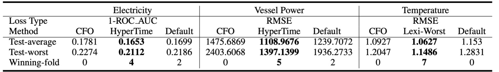
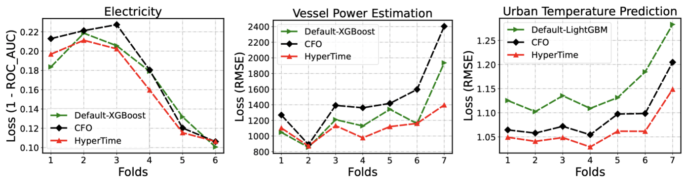
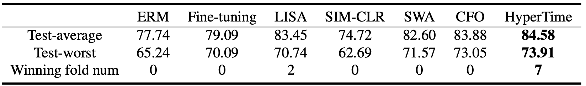
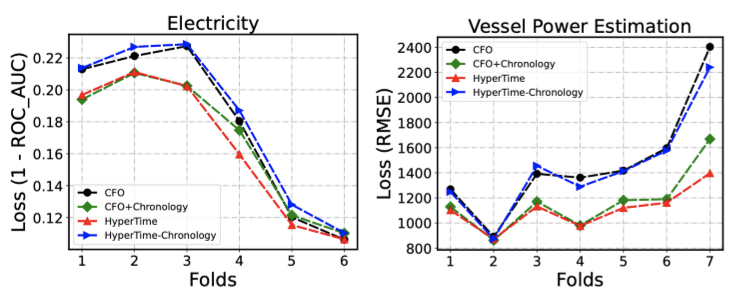
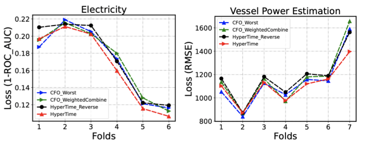
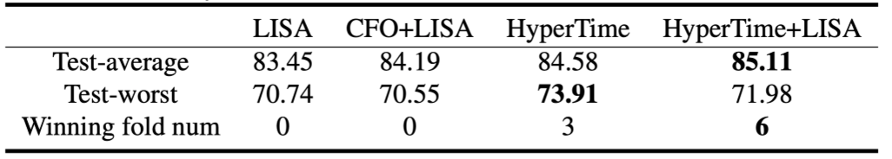
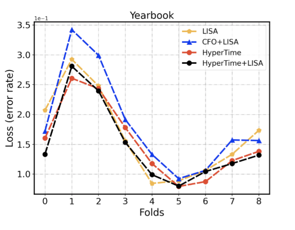

# HyperTime: Hyperparameter Optimization for Combating Temporal Distribution Shifts

<!-- ## **Notice**

We will continue to verify the effectiveness of HyperTime on more datasets and learners and update the correponding results in the future in this page.  -->

## Introduction

This repository is the implementation of ICML submission **HyperTime: Hyperparameter Optimization for Combating Temporal Distribution Shifts**. 

The implementation of our method HyperTime is built upon an open-source AutoML library named FLAML. Thus the submitted code includes part of flaml’s code. But we emphasize that the contributors and copyright information about the open-source library FLAML do not necessarily reveal the identities of the authors of this work. We plan to open source the code accompanying the formal publication of this paper.

This version of the code is made to facilitate the peer review of the ICML 2023 submission of our paper. 
We plan to release the code accompanying the formal publication of this paper. 
We will continue to verify the effectiveness of HyperTime on more datasets and learners and update the correponding results in the future in this page.

## Datasets

### Tabular datasets.

- Electricity: A classification task which is available on [OpenML](https://www.openml.org/search?type=data&sort=runs&id=151&status=active). It is widely used for
evaluating distribution shifts mitigation methods. The dataset contains two and a half years
of data. We exclude the first half years and use the next
one year for training and the last year for testing. We split
every 2 months into one fold. 

- Vessel power estimation: A regression task taken from
Wild-Time benchmark (Malinin et al., 2021). It is a large
dataset with 523,190 training samples over 4 years, and
we use the out-of-distribution dev-set as our test data
which has 18,108 samples. We split the training data
uniformly into 12 folds, and the test data into 7 folds.

- Temperature prediction: A regression task to predict
the urban daily maximum of average 2-m temperature. It
has distribution shifts as mentioned in (Kay et al., 2015;
Oleson et al., 2018). We split every 5 years into one fold
and we use the first 40 years for training and testing on
the remaining 35 years. More information could be found in [3].


### Image datasets.

- YearBook: Yearbook is an image classification
dataset which consists of 33,431 american high school year-
book photos. Since the changing of the social norms, fashion
styles, and other potential factors that may change with the
passage of time, there exists temporal distribution shifts in
it. We use the same experiments setting as [1].

<!-- In tuning XGboost, we verify the performance of LexiFlow on the datasets shown below. All of these datasets are available on OpenML.

1. In tuning random forest and Xgboost, the datasets we use in our paper are all available in openml.
2. In tuning neural networks, we verify the performance of LexiFLOW on [FashionMnist](https://www.kaggle.com/datasets/zalando-research/fashionmnist) dataset. -->

## Experiments

### **Requirements**

To install requirements:
```setup
pip install -r requirements.txt
```


### **How to run** 

1. **Main experiments**
    - Tabular Data

	```python
	# Run single train
	python exp_tabular/main.py  --algorithm 'hypertime' \
                	--dataset 'electricity' \
                	--estimator 'xgboost' \
                	--metric 'roc_auc' \
                	--budget 7200 \
                	--seed 1 &

	# Run single test
	python exp_tabular/test.py --algorithm 'hypertime' \
                	--dataset 'electricity' \
                	--estimator 'xgboost' \
	               	--metric 'roc_auc' \
                	--budget 7200 \
                	--seed 1 &

	#Run batch train
	bash scripts/run_electricity.sh

	#Run batch test
	bash scripts/run_test.sh
	```

    It will run HyperTime on electricity with XGboost. The time budget is 7200.


    - YearBook 

    ```python
    # Search HPs
    python exp_yearbook/main.py --dataset yearbook \
                                --estimator nn \
                                --metric accuracy \ 
                                --budget 10800 \ 
                                --algorithm cfo \
                                --seed 0 &

    # Test
    python exp_yearbook/test.py --dataset yearbook \
                                --estimator nn \
                                --metric accuracy \ 
                                --budget 10800 \
                                --algorithm cfo \
    ```

    It will run cfo on yearbook with Neural networks. The time budget is 10800s.


2. **Combining HPO algorithms with robust training method LISA**

    ```python
    python Tune-Lisa/yearbook.py --budget 10800  \
                                 --hpo_method HyperTime \ 
                                 --seed 0 \  
                                 --device 0 \
    ```    
## Results - Effectiveness

1. **Results on tuning tree-based learners**

    <p float="left">
    
    </p>


    <p float="left">
    
    </p>
    
    <!-- <p float="left">
    
    </p> -->


2. **Results on tuning neural networks**

    <p float="left">
    
    </p>


    <!-- <p float="left">
    
    </p> -->

## Results - Ablation

1. **The construction of validation sets**
   
    <p float="left">
    
    </p>

2. **The orientation of optimization objectives**

    <p float="left">
    
    </p>


## Results - Combining with robust training method

<p float="middle">

</p>

<p float="middle">

</p>

## References
[1]: Yao, H., Choi, C., Lee, Y., Koh, P. W., and Finn, C.
Wild-time: A benchmark of in-the-wild distribution shift
over time. In ICML 2022 Shift Happens Workshop,
2022a

[2]: Malinin, A., Band, N., Gal, Y., Gales, M., Ganshin, A., Ches-
nokov, G., Noskov, A., Ploskonosov, A., Prokhorenkova,
L., Provilkov, I., Raina, V., Raina, V., Roginskiy, D.,
Shmatova, M., Tigas, P., and Yangel, B. Shifts: A
dataset of real distributional shift across multiple large-
scale tasks. In Thirty-fifth Conference on Neural Infor-
mation Processing Systems Datasets and Benchmarks
Track (Round 2), 2021

[3]: Zheng, Z., Zhao, L., and Oleson, K. W. Large model
structural uncertainty in global projections of urban heat
waves. Nat Commun, 12(1), 2021. ISSN 2041-1723. 
